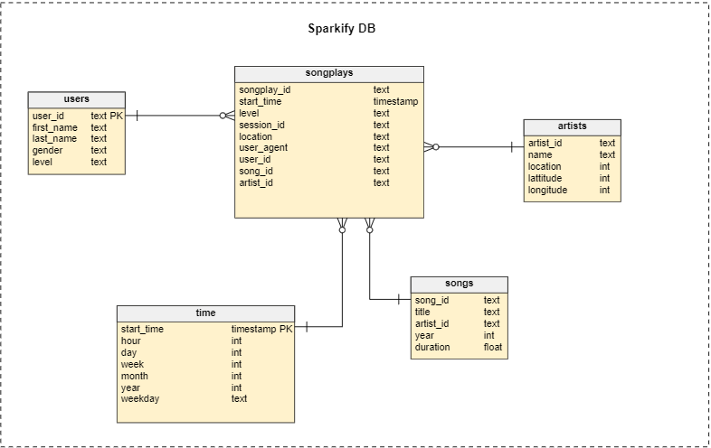
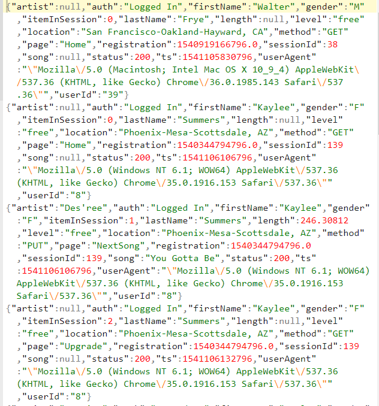
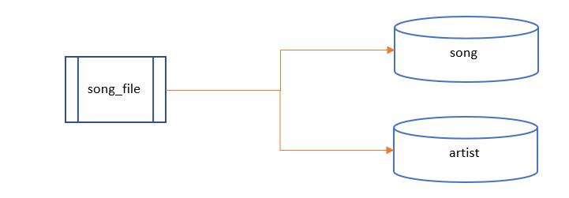
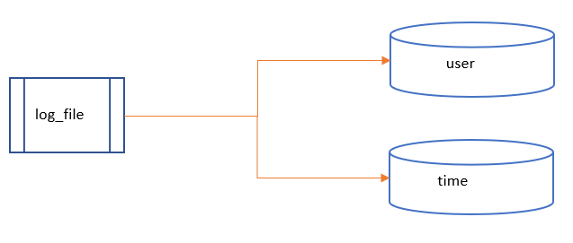
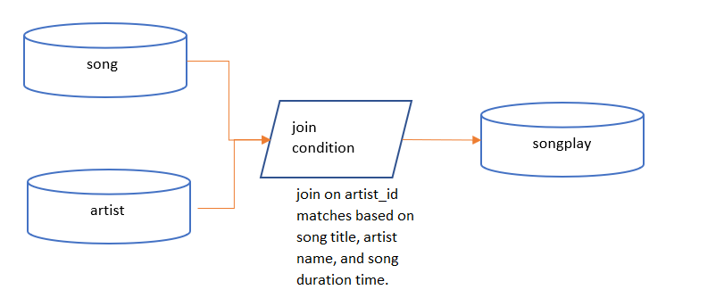
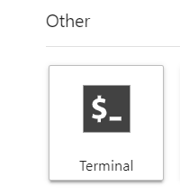
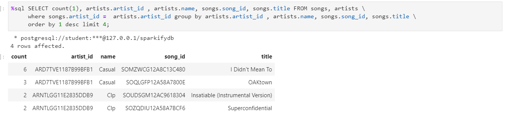

#  Data Modeling with Postgres & ETL Pipeline for Sparkify 
***
<a id="toc"></a>
### Table of Contents
***
- [Introduction](#intro)
- [Description](#describe)
- [Data Model for Song Play Analysis](#dm)
  - [Fact Table](#facttable)
  - [Dimension Tables](#dim)
- [Project Dataset in the repository](#data)
- [Processing Song and log File](#process)
- [Files](#Files)
- [Instruction to Run the Python Scripts](#exec)
- [Example queries and results for song play analysis](#exm)


<a id="intro"></a>

### Introduction
***
A startup called Sparkify wants to analyze the data they've been 
collecting on songs and user activity on their new music streaming app. They would like the Data Engineer to build
Database schema and ETL Data pipeline  to load data into the Database and optimise the queries for songplay analysis.

<a id="describe"></a>
### Description
***
The purpose of this project is build a Dimension model in  Postgres database  and Develop ETL pipeline and load the data available in json files 
provided and optimize the sql queries to perform various kind of data analysis for songplay analysis.

<a id="dm"></a>
### Data Model for Song Play Analysis
***
Using the song and log datasets, We have built a Dimension model which contains a star schema as shown below, 

It includes

<a id="facttable"></a>
#### Fact Table

1. **songplays** - records in log data associated with song plays, i.e., records with
  page `NextSong`
    - *songplay_id, start_time, user_id, level, song_id, artist_id, session_id,
      location, user_agent*

<a id="dim"></a>

#### Dimension Tables

2. **users** - Following information about users:
    - *user_id, first_name, last_name, gender, level*

3. **songs** - Following info about songs:
    - *song_id, title, artist_id, year, duration*

4. **artists** - Artists information:
    - *artist_id, name, location, latitude, longitude*

5. **time** - timestamps of records in **songplays** broken down into specific units
    - *start_time, hour, day, week, month, year, weekday*
    
    


<a id="data"></a>
### Project Dataset in the repository
***
1.  **song_data**

This is what a songs file looks like:

<pre>
{"num_songs": 1, "artist_id": "ARD7TVE1187B99BFB1", "artist_latitude": null, "artist_longitude": null, "artist_location": "California - LA", "artist_name": "Casual", "song_id": "SOMZWCG12A8C13C480", "title": "I Didn't Mean To", "duration": 218.93179, "year": 0}
</pre>

2. **log_data**


This is what a single log file looks like.



<a id="process"></a>
### Processing Song and log File

1. **Song File Processing**

    We will extract data for songs table by using   the columns corresponding to the songs table . Similarly, we'll select the appropriate columns for artists table.


  

```python
song_data = df[["song_id", "title", "artist_id", "year", "duration"]].values[0]
song_data
# Looks like this
# array(['SONHOTT12A8C13493C', 'Something Girls', 'AR7G5I41187FB4CE6C', 1982, 233.40363], dtype=object)

artist_data = df[["artist_id", "artist_name", "artist_location", "artist_latitude", "artist_longitude"]].values[0]
artist_data
# Looks like this
# array(['AR7G5I41187FB4CE6C', 'Adam Ant', 'London, England', nan, nan], dtype=object)
```

2. **Log File Processing**

  
  

3. **Loading Fact table songplay**

For `songplays` table, we will require information from `songs` table, `artists` table and the original log files. Since the log files do not have `song_id` and `artist_id`, we need to use `songs` table and `artists` table for that. The *song_select* query finds the `song_id` and `artist_id` based on the *title, artist_name,* and *duration* of a song. For the remaining columns, we can select them from the log files.

  


<a id="Files"></a>
### Files
***
<pre>
.
├── create_tables.py------# Drops and creates tables. Running this file resets
|                           the tables before each time we run ETL scripts.
├── etl.ipynb-------------# Reads and processes a single file from song_data and
|                           log_data and loads the data into our tables.
├── etl.py----------------# Reads and processes files from song_data and
|                           log_data and loads them into our tables. We'll fill
|                           this based on ETL notebook.
├── sql_queries.py--------# Contains all our SQL queries, and is imported into
|                           the last three files above.
└── test.ipynb------------# Displays the first few rows of each table to let us
                            check our database.
</pre>

<a id="exec"></a>
### Instruction to Run the Python Scripts.
***

Step 1: Open the terminal.Click on the below icon in the console


 

Step 2: execute create_table.py by copying the below command in terminal and press enter.
         
       python create_table.py

Step 3: Loads the files in the repository by executing etl.py by copying the below command in terminal and press enter.

       python etl.py
       
       
  
      
Step 4:  Run test.ipynb to see the data in each table.

<a id="exm"></a>
### Example queries and results for song play analysis
***
1. Which artist have sung the same song maxium number of time. Display the top 4?

  
2. Who is the  most popular artists in 2018? And where are they from?
3. Which is the most popular songs in 2018 among Females?
4. What is the maximum number of songs sung by one artist?